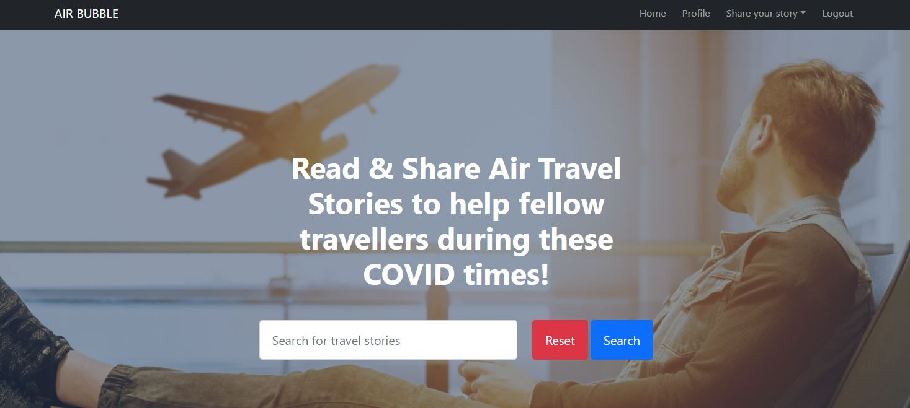

<div align="center">
    <a href="https://air-bubble-milestone3.herokuapp.com/travel_stories" target="_blank"></a>
    <h2>
        Air Bubble website is a travel story sharing portal for assisting the air travellers during this covid times
    </h2>
    <h3><a href="https://github.com/murthy1811/Milestone-Project-3-AirBubble" target="_blank">Click here</a> to view the site on GitHub pages.</h3>
</div>

## Table of Contents

1. [**Overview**](#overview)
2. [**User Experience**](#user-experience)
    - [**User Stories**](#user-stories)
    - [**Site owner Stories**](#site-owner-stories)
    - [**Database diagram**](#database-diagram)
    - [**Wireframes**](#wireframes)
    - [**Design**](#design)
3. [**Features**](#features)
    - [**Homepage Features**](#homepage-features)
    - [**Signup page Features**](#signuppage-features)
    - [**Login page Features**](#loginpage-features)
    - [**Share your story page Features**](#shareyourstory-features)
    - [**Read More page Features**](#readmorepage-features)
    - [**Logout page Features**](#logoutpage-features)
    - [**Future Features**](#future-features)
4. [**Technologies Used**](#technologies-used)
5. [**Testing**](#testing)
6. [**Deployment**](#deployment)    
7. [**Credits**](#credits)
8. [**Acknowledgements**](#acknowledgements)

## Overview

The main aim of this website is to provide access to the information regarding all the necessary COVID measures to be taken for air travel 
for the passengers around the globe

Business Goals

  - Create an information sharing website

    - During this COVID times, Air travel became more hard and is filled with many rules to be followed and documents to be submitted. Rules and 
      information are different to different destinations. This websites facilitates the users to share their travel stories to help the fellow
      travellers during this tough times.

  - Provide a simple interface to access the information

    - User can simply make a search with their destination country name or airport code or a keyword they want to search. Results would give the user
      travel stories already added by other users 

  - A webiste that is useful to all across the world

    - Extremely helpful user database to all the air travellers across the world. User database can be put into more use in future.

User goals

  - A one stop website for all the information an air traveller need during this COVID times.

    - Stories added by the users provide the information needed and measures to be taken to travel to a certain destination. There by helping an 
       anxious traveller 

  - An easy to search information website

    - Search bar straight on the Home page will provide results based on the user input like country name, airport code and other keywords.

  - Easy to ask the questions or make comments related to each travel story

    - User can ask questions through the comments back after reading the each travel story.Any User can pose a question with out login.

  - Easy to share the User own story with the community

    - User easily register, and share their own travel story with the community. User can login, logout and edit, delete their own stories
      user can change their password to their profile


## User Experience

- ### User Stories

    As a guest user of Air Bubble website for the first time, I want:
    
    1. To understand easily what the site is all about
    2. To search for information related to the recent travels happened to the destination I want to travel.
    3. To be able to ask more questions related to a particular user travel story without signing up.
    4. To be able to easily access all available website features from different screen size devices
    5. To be able to sign up easily for the website
 

    As a regsitered user of Air Bubble website, I want:

    1. To be able to login to the site using my username and password.
    2. To be able to add my travel experience to contribute to the community
    3. To be able to see all my added stories on my profile and can edit or delete them
    4. To be able to confirm the deletion before I delete my added travel story
    5. To be able to change my password in the profile


- ### Site owner stories

    As an admin/ site owner of Air Bubble website, I want:

    1. To be able to delete stories and comments contributed by registered/guest users if necessary.
    

- ### Database diagram

  - [Database Diagram](https://github.com/murthy1811/Milestone-Project-3-AirBubble/blob/master/static/assets/wireframes/database_diagram.jpg).
  

- ### Wireframes

  The wireframes for this project were created using figma.
    
  - [Desktop Home](https://github.com/murthy1811/Milestone-Project-3-AirBubble/blob/master/static/assets/wireframes/desktop_home.jpg).

  - [Tablet Home](https://github.com/murthy1811/Milestone-Project-3-AirBubble/blob/master/static/assets/wireframes/tablet_home.jpg)

  - [Mobile Home](https://github.com/murthy1811/Milestone-Project-3-AirBubble/blob/master/static/assets/wireframes/mobile_home.jpg)

  - [Desktop Login or Signup](https://github.com/murthy1811/Milestone-Project-3-AirBubble/blob/master/static/assets/wireframes/desktop_login_signup.jpg).

  - [Mobile Login or Signup](https://github.com/murthy1811/Milestone-Project-3-AirBubble/blob/master/static/assets/wireframes/tablet_login_signup.jpg)

  - [Mobile Login or Signup](https://github.com/murthy1811/Milestone-Project-3-AirBubble/blob/master/static/assets/wireframes/mobile_login-signup.jpg)

  - [Desktop New or Edit Story](https://github.com/murthy1811/Milestone-Project-3-AirBubble/blob/master/static/assets/wireframes/desktop_newstory_editstory.jpg).

  - [Tablet New or Edit Story](https://github.com/murthy1811/Milestone-Project-3-AirBubble/blob/master/static/assets/wireframes/tablet_newstory_editstory.jpg)

  - [Mobile New or Edit Story](https://github.com/murthy1811/Milestone-Project-3-AirBubble/blob/master/static/assets/wireframes/mobile_newstory_editstory.jpg)

  - [Desktop Profile](https://github.com/murthy1811/Milestone-Project-3-AirBubble/blob/master/static/assets/wireframes/desktop_profile.jpg).

  - [Tablet Profile](https://github.com/murthy1811/Milestone-Project-3-AirBubble/blob/master/static/assets/wireframes/tablet_profile.jpg)

  - [Mobile Profile](https://github.com/murthy1811/Milestone-Project-3-AirBubble/blob/master/static/assets/wireframes/mobile_profile.jpg)

  - [Desktop Readmore](https://github.com/murthy1811/Milestone-Project-3-AirBubble/blob/master/static/assets/wireframes/desktop_readmore.jpg).

  - [Tablet Readnore](https://github.com/murthy1811/Milestone-Project-3-AirBubble/blob/master/static/assets/wireframes/tablet_readmore.jpg)

  - [Mobile Readmore](https://github.com/murthy1811/Milestone-Project-3-AirBubble/blob/master/static/assets/wireframes/mobile_readmore.jpg)


- ### Design

  - #### Colour Scheme

    I used the bootstrap theme 'Landing Page' from startbootstrap.com . Color theme has not been changed much from the template. 

  - #### Typography

    Fonts were also carried on from the template with a minor change of using basic fonts 'Lucida Sans' 'Franklin Gothic medium' for the travel story cards

  - #### Imagery

    Main home page is taken from Unsplash.com. The traveller image in an airport with a suitcase did a spledind job in carrying the website intent.

## Features

- ### Homepage Features

   1. Navigation bar with clear guidance to the user for home, login and signup.and for signed up user, profile, share your story and logout pages.
   2. Welcome information and main search bar for stories is implemented straight away on hero image
   3. All travel stories posted were displayed in clean cards setup, a feature taken from bootstrap
   4. A Call out for all website visitors to sign up for sharing their travel stories

- ### Sign up page Features

   1. User can sign up for the website to share their story in simple steps.
   2. A simple username of their choice and password, and their email address can be entered and they will be taken to their profile page.
   3. Existing email address or username will not be accepted and user will be guided accordingly

- ### Login page Features

    1. User asked to enter their username and password and will be taken to profile page
    2. If wrong username or password is entered, an unique message error will be given

- ### share your story page Features

    1. User can add a new story or edit their story
    2. Edit story option takes user to the profile page, and stories can be edited directly from profile page as well.
    3. New story page has all the mandatory rows to be filled and advise the user to fill in 
    4. A textarea is provided for the user to write his complete experiences.

- ### Read more page features

    1. Read more button on all travel stories on home page takes user to read full information on each story
    2. Comments section is provided for user to interact with the original user who added the story.
    3. Anyone can interact on the comments section and help each other by guiding further clearly 


- ### Logout page features

    1. Simple click on logout will let the user log out of his/her profile and takes back to the login page


### Future Features
 
The following are elements that could be added to the website in future development:

- A forgot password option where,on clicking asks user to input their email and a password change link can be sent to their email

- A online chat window where all registered users can interact live.

- Admin user is not given confirmation before deletion option due to time constrain, and also with intent that admin will have due diligence before
  deleting a story


## Technologies Used

- #### **Front-end**

    ### Languages Used

    - [HTML5](https://en.wikipedia.org/wiki/HTML5)

    - [CSS3](https://en.wikipedia.org/wiki/Cascading_Style_Sheets)

    - [JavaScript](https://www.javascript.com/)

    - Python

    ### Frameworks, Libraries & Programs Used

    - [Startbootstrap](https://startbootstrap.com/)

    - Startbootstrap is used to select the theme 'Landing page' for the website and form html code is generated using the same.

    - [jQuery](https://jquery.com/)

    - jQuery is used to simplify the JavaScript code and DOM manipulation. 

    - [Bootstrap 4.5](https://getbootstrap.com/)

    - Bootstrap is used to assist with the responsiveness and styling of the website.

    - [GitPod](https://gitpod.io)

    - GitPod was used as the IDE for this project.

    - [Git](https://git-scm.com/)

    - Git is used for version control by utilizing the Gitpod terminal to commit to Git and Push to GitHub.

    - [GitHub](https://github.com/)

    - GitHub is used to store the project's code after being pushed from Git.

    - [Figma](https://www.figma.com/wireframe-tool/)

    - Figma is used to create the wireframes during the design process.

    - [Font Awesome](https://fontawesome.com/)

    - Font Awesome is used to obtain the icons used in this website.

    - [Autoprefixer](https://autoprefixer.github.io/)

    - Autoprefixer was used to add vendor prefixes.

    - [JS hint](https://jshint.com/)

    - Jasmine was used to test this project's JavaScript functions.


- #### **Back-end**
    * **[Flask](https://flask.palletsprojects.com/en/1.1.x/)** - a lightweight micro web framework written in Python used to create a simple,
        clean code and to reduce development time.
    * **[MongoDB](https://www.mongodb.com/2)** - non-relational database, used to store, manipulate and retrieve data.
    * **[Werkzeug](https://werkzeug.palletsprojects.com/en/1.0.x/)** - used with Flask to securely store passwords with salted hashes and verify
        user passwords to authenticate users.
    * **[Flask Jinja](https://flask.palletsprojects.com/en/1.1.x/templating/)** - used as it's a part of a Flask package and to allow template inheritance.


- #### **Deployment**
    * **Git** - used to keep track of the changes made to the repository and for version control.
    * **Gitpod** - I used CI full template as an IDE to develop, commit and push files to GitHub. 
    * **GitHub** - used as a hosting service and for future collaborations.
    * **Heroku** - my GitHub repo for this project had been connected to Heroku app to enable management and deployment of this app.

## Testing

The testing data for this project can be found in a separate file called [here](https://github.com/murthy1811/Milestone-Project-3-AirBubble/blob/master/TESTING.md).

### Issues and Solutions
* travel story cards on small screens overlapped due to no media queries intially. CSS is fixed later
* No defensive deletion confirmation added for admin user due to lack of time, but also intended admin user uses due diligence before deleting 
* While Code validations, found defensive deletion missing for session user in read more page. Fixed later by adding modal
* Form input for origin_country is not taking spaces intially but later fixed by adjusting pattern attribute
* While python code is checked for PEP8 requirements, indentation went wrong and edit-story page did not functioned. Indentation fixed later.
* Edit story page cancel button takes you to home page instead of profile page. Fixed by adjusting the jinja code url.
* Logged user can delete their comments and feature is not added due to time constraint. Only Admin can delete the comments

## Deployment

- #### **Requirements:**
    * **Python3** to write the code and run the application
    * **PIP** to install packages
    * **Git** for version control
    * **GitPod** powered by VS Code was used for this project (any IDE of your choice will work)
    * **MongoDB** - to create and manipulate the database
    * **Heroku** - to deploy and manage the app


### Project Creation

* This project was created using the CI recommended [Gitpod Full Template](https://github.com/Code-Institute-Org/gitpod-full-template).
* Click on **_Use this template_** button and enter a short and memorable name of your choice for your repo and select **_Create repository from template_**. 
* Once created, click on green **_Gitpod_** button to open your new workspace. 

### Deployment to Heroku
Heroku cloud platform was used to deploy and host this app by following the steps below:

* **Set up workspace for Heroku:** 
    * In the terminal window of your IDE, create a requirements.txt file to contain all applications and dependencies required to run the app.

        ``` pip3 freeze --local . requirements.txt```
    * Create a Procfile (always with a capital P and no file extension!) - required by Heroku, to know which file runs the app.

        ``` echo web: python app.py > Procfile```

* **Create application in Heroku:**
    * Navigate to [Heroku](https://www.heroku.com/home) website and create an account.
    * Once logged in, click on the **_New_** button and select **_Create New App_**
    * Create a name for your app and select the region closest to your location.

* **Connect your app to GitHub repository:**
    * On the **_Deploy_** page, select GitHub as your **_Deplyment method_**.
    * You will then be prompted to find the github repository, click on **_Connect_** button to connect.
    * Click on the **_Settings_** tab and and select **_Config Vars_** and **_Reveal Config Vars_**.
    * Add the following variables (as stored in env.py):

    ```
    os.environ.setdefault("IP", "0.0.0.0")
    os.environ.setdefault("PORT", "5000")
    os.environ.setdefault("SECRET_KEY", "paste_your_secret_key_from_env.py")
    os.environ.setdefault("MONGO_URI", "obtained_from_your MongoDB_account")
    os.environ.setdefault("MONGO_DBNAME", "your_db_name")
    ```
    * In the IDE terminal, push the two new files to the GitHub repository:
    ```
    git add requirements.txt
    git commit -m "Add requirements.txt"        
    ```
    ``` 
    git add Procfile
    git commit -m "Add Procfile"
    git push
    ```
* Now go back to Heroku and click on **_Enable Automatic Deployment_** and **_Deploy Branch_**.
* The app is now connected and Heroku will receive the code from GitHub and automatically update whenever we push changes to the GitHub repository. You should be able to see "Your app was successfully deployed!". Click on **_View_** to launch your app.


### Clone the project
Steps required to **_Clone_** a repository from GitHub to your local machine:
* Navigate to the repository in GitHub.
* Click on the **_Code_** dropdown menu button.
* Click on **_Open with GitHub Desktop_** and follow the prompts to complete the cloning process.

### Fork the project
* To create a personal copy of this repository, click on **_Fork_** button on the top right corner of the repository page in GitHub.


### Run Locally
To run this project on your device using the IDE of your choice follow these steps:
* Install the requirements by typing in your IDE: 

    ```pip3 install -r requirements.txt```
* Navigate to [MongoDB](https://www.mongodb.com)
    * Create an account and sign in. 
    * Click on **_Create New Cluster_** and then **_+ Create Database_** to create a database.
    * Create **category**, **travel_stories**, **user_profile** and **user_comments** collections in the database as shown below:

    **_category_**
    ```
    _id: <ObjectId>
    category_name:<string>
    ```
    **_travel_stories_**
    ```
    _id: <ObjectId>
    category_name:<string>
    origin:<string>
    origin_country:<string>
    transit:<string>
    transit_country:<string>
    destination:<string>
    destination_country:<string>
    date_of_journey:<int>
    no_of_adults:<int>
    kids_under_12:<int>
    kids_under_6:<int>
    covid_report:<array>
    your_experience:<string>
    added_by:<string>
    ```
    **_user_profile_**
    ```
    _id: <ObjectId>
    emailaddress:<string>
    username:<string & Int>
    password:<string & Int>
    ```

    **_user_comments_**
    ```
    _id: <ObjectId>
    comment:<string>
    linked_travel_id:<travel_stories.ObjectId>
    
    ```

* In your IDE terminal, create the environment variables:   
    * Type ```touch env.py``` 
    in the terminal to create the file in the root directory. This file is used to store sensitive data (see environment variables above) and should never be pushed to GitHub.
    * To ignore it, create .gitignore file by typing 

    ```touch .gitignore``` 

    and add env.py into this file.
* You can now run the app, just type in the IDE terminal: 

    ```python3 app.py```. 


**[back to top](#wd-buzzwords)**

## Credits

### Code

- The JavaScript for the project is adapted from from the bootstrap.com and startbootstrap.com
- HTML code and css  is also adapted from the template from startbootstrap.com
- Hero image is from Unsplash.com - Photo by JESHOOTS.COM

## Acknowledgements

Thank you to my mentor Excellence Ilesanmi for his support and guidance during this project.

Thank you to the Code Institute Slack community for their advice and tips.


<div align="right">
    <a href="#table-of-contents"> ⇧ Back To Top </a>
</div>